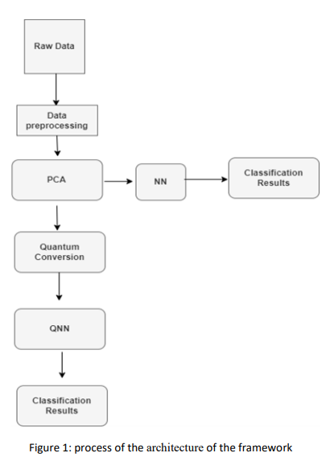
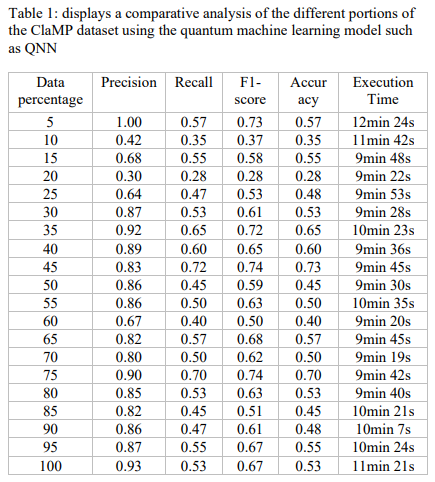
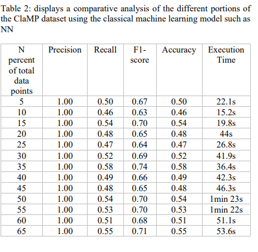
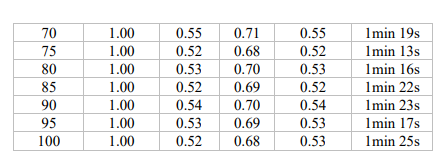

# QML-Software-Supply-Chain

The dataset can be found here: https://www.kaggle.com/datasets/saurabhshahane/classification-of-malwares

- **Objective:** Distinguish the performance between Quantum Neural Networks (QNN) and 
  Conventional Neural Networks (NN) in the context of Software Supply Chain attacks.
- **Methodology:** Comparative analysis using the ClaMP dataset, 
  developed models utilizing Pennylane for QNN and TensorFlow, and Keras for NN.
- **Results:** QNN demonstrated slower execution times with larger datasets but holds promise 
  due to recent advancements in quantum computing.

In an era marked by the steady evolution of software supply chain threats, 
the need for innovative and robust solutions has never been more critical.
This project addresses the urgent demand for advanced security solutions
by leveraging Quantum Machine Learning (QML) to analyze and counteract 
software supply chain attacks, comparing its efficacy to traditional Machine Learning (ML) methods.

The methodology implemented in this research is a meticulous approach focusing on the Quantum Neural Network (QNN) aspect of Quantum Machine Learning (QML). The following section outlines the step-by-step methodology employed:

1. **Data Pre-processing:**
   We initiated the research by pre-processing raw data from the ClaMP dataset using Python and Scikit-Learn. The shuffle function, the index-reset function, and the drop function were integral in this phase to ensure the optimum condition of the dataset.

2. **Balanced Dataset Construction:**
   We meticulously constructed balanced portions of the dataset to avoid any imbalances that might lead to inaccurate predictions. Only balanced portions were considered for the experiment.

3. **Data Segmentation:**
   The entire dataset, consisting of 5,210 rows, was split into 20 smaller, ascending datasets ranging from 5% to 100% of the total dataset. Each separated dataset then underwent QML model application.

4. **Feature Encoding:**
   Features were encoded into quantum states, ensuring all categorical values were converted to numerical and normalized, maintaining a uniform scale across all values.

5. **Quantum Neural Network (QNN) Application:**
   
   
   QNN was then applied, leveraging neurocomputing theory, quantum computing, and artificial neural networks. The data were encoded into suitable qubit states and processed through parameterized rotation and entangling gates. The resulting values were then decoded into applicable output data, with precision and accuracy denoted by {s (n), d(n)}.

7. **Adam Optimizer:**
   The parameters were updated based on specific criteria including size, depth, and accuracy, considering the complexity-theoretic measurements, with the aim to solve in-depth measurement issues efficiently.

8. **Precision & Accuracy:**
   Precision {s (n), d(n)} was meticulously determined, measuring the number of qubits in the circuit in size and the longest sequence of gates from input to output in depth. The circuits' accuracy was defined by O{s(n)}.

9. **Comparative Analysis:**
   The resultant data from the different portions of the dataset were then analyzed, compared, and discussed to provide insights into the performance of QML and ML in different conditions.

   Results:

   

   

   

**Paper title**
Software Supply Chain Vulnerabilities Detection in Source Code: Performance Comparison between  Traditional and Quantum Machine Learning Algorithms

**Paper Link**
https://ieeexplore.ieee.org/abstract/document/10020813

**PDF Copy**
https://arxiv.org/ftp/arxiv/papers/2306/2306.08060.pdf

**My Google scholar**
https://scholar.google.com/citations?view_op=list_works&hl=en&hl=en&user=PHg000cAAAAJ

  **Cite Work**

  Bibtex:  
  
  @inproceedings{akter2022software,
  title={Software supply chain vulnerabilities detection in source code: Performance comparison between traditional and quantum machine learning algorithms},
  author={Akter, Mst Shapna and Faruk, Md Jobair Hossain and Anjum, Nafisa and Masum, Mohammad and Shahriar, Hossain and Sakib, Nazmus and Rahman, Akond and Wu, Fan and Cuzzocrea, Alfredo},
  booktitle={2022 IEEE International Conference on Big Data (Big Data)},
  pages={5639--5645},
  year={2022},
  organization={IEEE}
}

MLA:

Akter, Mst Shapna, et al. "Software supply chain vulnerabilities detection in source code: Performance comparison between traditional and quantum machine learning algorithms." 2022 IEEE International Conference on Big Data (Big Data). IEEE, 2022.

APA:

Akter, M. S., Faruk, M. J. H., Anjum, N., Masum, M., Shahriar, H., Sakib, N., ... & Cuzzocrea, A. (2022, December). Software supply chain vulnerabilities detection in source code: Performance comparison between traditional and quantum machine learning algorithms. In 2022 IEEE International Conference on Big Data (Big Data) (pp. 5639-5645). IEEE.

   

